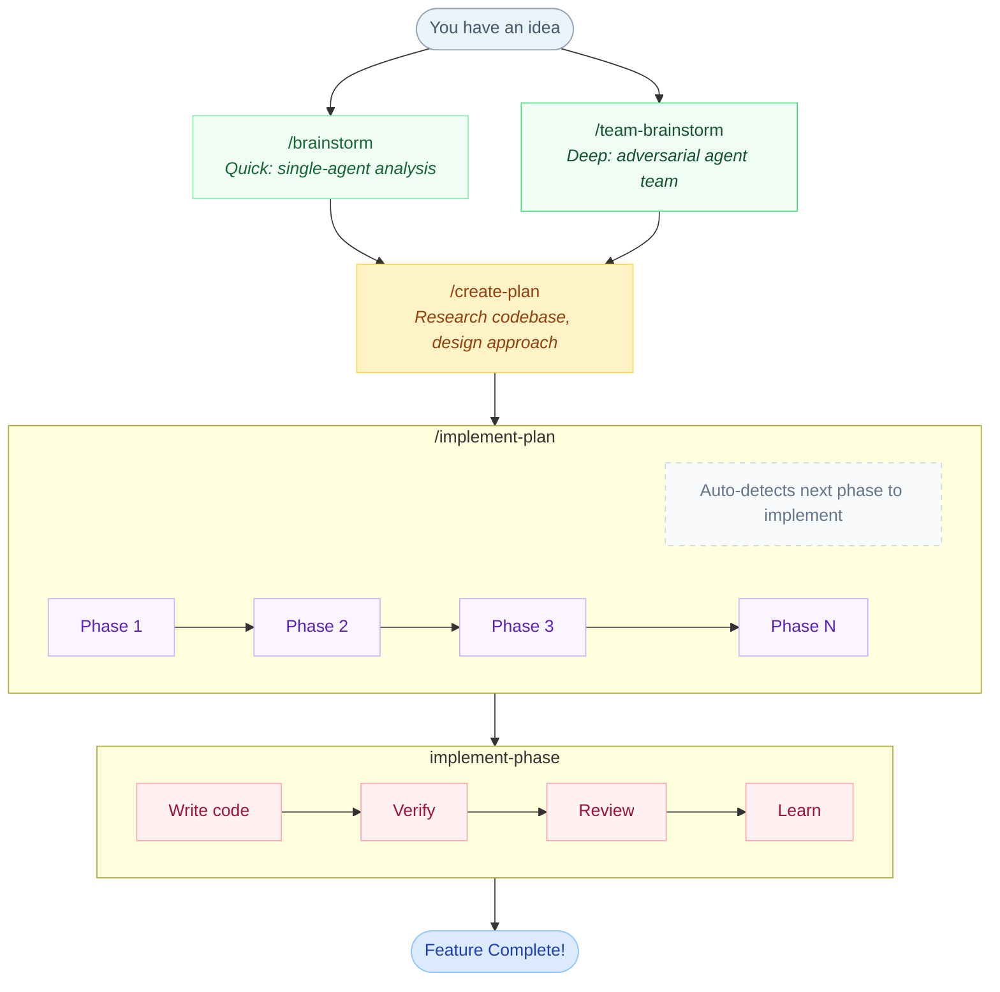

# Implementation Workflow Overview

A high-level guide to the Claude Code skills-based implementation workflow.

> **Want more detail?** See the [Detailed Workflow Guide](02-detailed-workflow.md) for step-by-step instructions with rationale.

## The Big Picture



<details>
<summary>ASCII fallback (if Mermaid doesn't render)</summary>

```
┌─────────────────────────────────────────────────────────────────────────────┐
│                         YOUR IMPLEMENTATION JOURNEY                          │
├─────────────────────────────────────────────────────────────────────────────┤
│                                                                              │
│    ╔═══════════════╗                                                        │
│    ║   You have    ║                                                        │
│    ║   an idea     ║                                                        │
│    ╚═══════╤═══════╝                                                        │
│            │                                                                 │
│            ▼                                                                 │
│    ┌───────────────┐     "What am I really trying to build?"                │
│    │  /brainstorm  │     Clarify your idea through questions                │
│    └───────┬───────┘                                                        │
│            │                                                                 │
│            ▼                                                                 │
│    ┌───────────────┐     "How do I break this into phases?"                 │
│    │ /create-plan  │     Research codebase, design approach, create plan    │
│    └───────┬───────┘                                                        │
│            │                                                                 │
│            ▼                                                                 │
│    ┌───────────────────────────────────────────────────────────────┐        │
│    │                     /implement-plan                            │        │
│    │  ┌─────────┐   ┌─────────┐   ┌─────────┐   ┌─────────┐       │        │
│    │  │ Phase 1 │──▶│ Phase 2 │──▶│ Phase 3 │──▶│ Phase N │       │        │
│    │  └────┬────┘   └────┬────┘   └────┬────┘   └────┬────┘       │        │
│    │       │              │              │              │           │        │
│    │       ▼              ▼              ▼              ▼           │        │
│    │  ┌─────────────────────────────────────────────────────────┐      │        │
│    │  │              implement-phase                         │      │        │
│    │  │  • Write code (via subagents)                       │      │        │
│    │  │  • Run verification (build, test, lint)             │      │        │
│    │  │  • Code review                                      │      │        │
│    │  │  • Capture learnings                                │      │        │
│    │  └─────────────────────────────────────────────────────┘      │        │
│    └───────────────────────────────────────────────────────────────┘        │
│            │                                                                 │
│            ▼                                                                 │
│    ╔═══════════════╗                                                        │
│    ║   Feature     ║                                                        │
│    ║   Complete!   ║                                                        │
│    ╚═══════════════╝                                                        │
│                                                                              │
└─────────────────────────────────────────────────────────────────────────────┘
```

</details>

## Four Simple Steps

### Step 1: Brainstorm (Optional but Recommended)

Two options depending on depth needed:

```
Quick exploration (single agent):
  You: /brainstorm
       "I want to add user authentication"
  Claude: Asks clarifying questions, applies analysis frameworks
  Result: Clear, refined idea ready for planning (~8-12K tokens)

Deep analysis (agent team):
  You: /team-brainstorm
       "I want to add user authentication"
  Claude: Asks clarifying questions, then spawns a team:
          - Devil's Advocate attacks the idea
          - Optimist champions benefits
          - Creative Explorer generates alternatives
          - Researcher gathers evidence
          - (Optional) Architect evaluates feasibility
          Teammates debate each other for adversarial depth
  Result: Thoroughly contested, evidence-backed concept (~25-40K tokens)
```

**Why?** Prevents building the wrong thing. Use `/brainstorm` for quick ideas, `/team-brainstorm` for critical decisions where adversarial depth matters.

---

### Step 2: Create a Plan

```
You: /create-plan
     "Add user authentication with JWT"

Claude: 1. Researches your codebase
        2. Finds existing patterns
        3. Designs phased approach
        4. Creates plan document

Result: docs/plans/2026-01-25-user-auth.md
        + Tasks created with dependencies
```

**Why?** Plans break big problems into manageable phases. Each phase can be implemented, verified, and committed independently.

---

### Step 3: Implement the Plan

```
You: /implement-plan docs/plans/2026-01-25-user-auth.md

Claude: Executes each phase in order
        Phase 1 → Phase 2 → Phase 3 → ...

        Each phase goes through quality gates:
        ✓ Implementation
        ✓ Verification (build, test, lint)
        ✓ Code review
        ✓ Capture learnings
```

**Why?** Systematic execution with quality gates catches problems early. Each phase ends clean.

---

### Step 4: Clear and Continue (Your Workflow)

```
Phase 1 complete
    │
    ▼
/clear (or /compact)
    │
    ▼
/implement-plan (continues from Phase 2)
    │
    ▼
Phase 2 complete
    │
    ▼
/clear
    │
    ▼
/implement-plan (continues from Phase 3)
    │
    ...and so on
```

**Why?** Keeps context fresh. Each phase gets full attention without accumulated context bloat.

---

## How Progress is Tracked

```
┌─────────────────────────────────────────────────────────────────┐
│                     TASK TOOLS (Persistent)                      │
├─────────────────────────────────────────────────────────────────┤
│                                                                  │
│   create-plan creates tasks:                                     │
│   ┌──────────────────────────────────────────────────────────┐  │
│   │  Tasks (0 done, 4 open):                                  │  │
│   │    ◻ #1 Phase 1: Database Schema                         │  │
│   │    ◻ #2 Phase 2: Auth Service › blocked by #1            │  │
│   │    ◻ #3 Phase 3: API Endpoints › blocked by #2           │  │
│   │    ◻ #4 Phase 4: Testing › blocked by #3                 │  │
│   └──────────────────────────────────────────────────────────┘  │
│                                                                  │
│   After Phase 1 completes:                                       │
│   ┌──────────────────────────────────────────────────────────┐  │
│   │  Tasks (1 done, 3 open):                                  │  │
│   │    ✓ #1 Phase 1: Database Schema                         │  │
│   │    ◻ #2 Phase 2: Auth Service (unblocked!)               │  │
│   │    ◻ #3 Phase 3: API Endpoints › blocked by #2           │  │
│   │    ◻ #4 Phase 4: Testing › blocked by #3                 │  │
│   └──────────────────────────────────────────────────────────┘  │
│                                                                  │
│   Progress persists across /clear and session restarts!         │
│                                                                  │
└─────────────────────────────────────────────────────────────────┘
```

**Key Benefit**: You can `/clear` between phases and progress is never lost. Task tools track where you are.

---

## How Learnings are Captured

```
┌─────────────────────────────────────────────────────────────────┐
│                    CONTINUOUS LEARNING                           │
├─────────────────────────────────────────────────────────────────┤
│                                                                  │
│   Patterns are captured at:                                      │
│                                                                  │
│   ┌──────────────────┐                                          │
│   │ Phase Completion │ ◄── When implement-phase finishes        │
│   └────────┬─────────┘                                          │
│            │                                                     │
│            ▼                                                     │
│   ┌──────────────────┐                                          │
│   │    /compact      │ ◄── Before context is compacted          │
│   └────────┬─────────┘                                          │
│            │                                                     │
│            ▼                                                     │
│   ┌──────────────────┐                                          │
│   │   Session End    │ ◄── When you exit Claude Code            │
│   └────────┬─────────┘                                          │
│            │                                                     │
│            ▼                                                     │
│   ~/.claude/skills/learned/                                      │
│   ├── error-resolution-001.md                                    │
│   ├── workaround-002.md                                          │
│   └── pattern-003.md                                             │
│                                                                  │
└─────────────────────────────────────────────────────────────────┘
```

**What Gets Captured**:
- Error resolutions (how you fixed tricky bugs)
- Workarounds (navigating framework limitations)
- User corrections (when you corrected Claude's approach)
- Project-specific patterns

---

## Quality Gates (Why We Have Them)

Each phase passes through 8 steps:

```
Step 1: Implementation      → Code is written
Step 2: Verification        → Build, lint, type-check, tests pass
Step 3: Integration Testing → Claude tests it actually works
Step 4: Code Review         → Quality check, patterns verified
Step 5: ADR Compliance      → Architectural decisions documented
Step 6: Plan Sync           → Verify work items completed
Step 7: Prompt Archival     → Clean up used prompts
Step 8: Completion Report   → Summary + learnings captured
```

**Why 8 steps?** Each step catches different problems:
- Step 2 catches broken code
- Step 3 catches "it compiles but doesn't work"
- Step 4 catches pattern violations and tech debt
- Step 5 ensures decisions are documented for future reference

---

## Skill Arguments

Skills support argument passing with hints shown in autocomplete:

```
/implement-plan docs/plans/my-feature.md    # $0 = plan path
/e2e-testing run https://localhost:3000     # $0 = mode, $1 = URL
/adr Use JWT for authentication             # $0 = decision title
```

The `argument-hint` in each skill shows expected arguments (e.g., `[plan-path]`, `[mode] [url?]`).

---

## Visualize Your Skills

Generate an interactive HTML visualization of the skills collection:

```
/skill-visualizer skills
```

Opens a browser with:
- Force-directed graph of all skills
- Color-coded by type (orchestrator/read-only/hybrid)
- Dependency arrows between skills
- Hover tooltips with descriptions

---

## Summary

| What | Command | Result |
|------|---------|--------|
| Clarify idea (quick) | `/brainstorm` | Refined concept |
| Clarify idea (deep) | `/team-brainstorm` | Adversarially tested concept |
| Create plan | `/create-plan` | Phased plan + tasks |
| Implement | `/implement-plan [path]` | Working code |
| Fresh start | `/clear` | Clean context, progress preserved |
| Visualize | `/skill-visualizer` | Interactive skill map |

**Your workflow**: Plan → Implement phase → Clear → Implement next phase → Clear → ...

Progress is tracked via Task tools. Learnings are captured at phase boundaries. You never lose your place.
